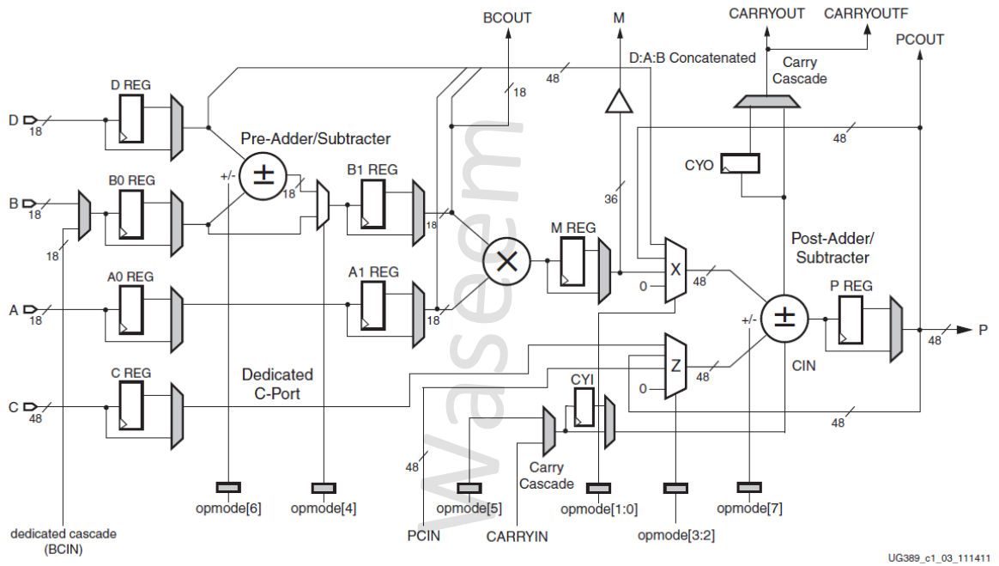

# Spartan 6 DSP48A1 Project

This repository contains the design and implementation of the DSP48A1 slice in Spartan-6 FPGAs. The DSP48A1 slice is ideal for math-intensive applications due to its high ratio of DSP slices to logic. The project involves creating a testbench to verify the design, using directed test patterns whenever necessary.

## Project Overview

The design flow for this project includes the following steps:
- Elaboration
- Synthesis
- Implementation

Ensure that there are no design check errors during the design flow. The source of the requirements can be found [here](https://www.xilinx.com/support/documentation/user_guides/ug389.pdf).

## Features

### Parameters (Attributes)

| Parameter           | Function                                                                                                                                                                                                                         |
|---------------------|----------------------------------------------------------------------------------------------------------------------------------------------------------------------------------------------------------------------------------|
| A0REG, A1REG, B0REG, B1REG | Defines the number of pipeline registers in the A and B input paths. Defaults: A0REG=0, A1REG=1, B0REG=0, B1REG=1. A0 and B0 are the first stages of the pipelines. A1 and B1 are the second stages of the pipelines.       |
| CREG, DREG, MREG, PREG, CARRYINREG, CARRYOUTREG, OPMODEREG | Defines the number of pipeline stages. Default: 1 (registered).                                                                                                                                                            |
| CARRYINSEL         | Used in the carry cascade input, either the CARRYIN input or opcode[5]. Default: OPMODE5.                                                                                                                                        |
| B_INPUT            | Defines whether the input to the B port is routed from the B input (DIRECT) or the cascaded input (BCIN). Default: DIRECT.                                                                                                      |
| RSTTYPE            | Selects whether all resets should be synchronous or asynchronous. Default: SYNC.                                                                                                                                                 |

### Data Ports

| Signal Name | Function                                                                                                                                                    |
|-------------|-------------------------------------------------------------------------------------------------------------------------------------------------------------|
| A           | 18-bit data input to multiplier, and optionally to post-adder/subtracter.                                                                                   |
| B           | 18-bit data input to pre-adder/subtracter, to multiplier, or to post-adder/subtracter.                                                                      |
| C           | 48-bit data input to post-adder/subtracter.                                                                                                                 |
| D           | 18-bit data input to pre-adder/subtracter. D[11:0] are concatenated with A and B and optionally sent to post-adder/subtracter.                               |
| CARRYIN     | Carry input to the post-adder/subtracter.                                                                                                                   |
| M           | 36-bit buffered multiplier data output, routable to the FPGA logic.                                                                                         |
| P           | Primary data output from the post-adder/subtracter.                                                                                                         |
| CARRYOUT    | Cascade carry out signal from post-adder/subtracter. Connected only to CARRYIN of adjacent DSP48A1 if multiple DSP blocks are used.                         |
| CARRYOUTF   | Carry out signal from post-adder/subtracter for use in the FPGA logic.                                                                                      |

### Control Input Ports

| Signal Name | Function                                 |
|-------------|------------------------------------------|
| CLK         | DSP clock                                |
| OPMODE      | Control input to select arithmetic operations of the DSP48A1 slice. |

### Clock Enable Input Ports

| Signal Name | Function                                      |
|-------------|-----------------------------------------------|
| CEA         | Clock enable for the A port registers         |
| CEB         | Clock enable for the B port registers         |
| CEC         | Clock enable for the C port registers         |
| CECARRYIN   | Clock enable for the carry-in and carry-out registers |
| CED         | Clock enable for the D port register          |
| CEM         | Clock enable for the multiplier register      |
| CEOPMODE    | Clock enable for the opmode register          |
| CEP         | Clock enable for the P output port registers  |

### Reset Input Ports

All resets are active high reset and can be synchronous or asynchronous depending on the parameter RSTTYPE.

| Signal Name  | Function                                  |
|--------------|-------------------------------------------|
| RSTA         | Reset for the A registers                 |
| RSTB         | Reset for the B registers                 |
| RSTC         | Reset for the C registers                 |
| RSTCARRYIN   | Reset for the carry-in and carry-out registers |
| RSTD         | Reset for the D register                  |
| RSTM         | Reset for the multiplier register         |
| RSTOPMODE    | Reset for the opmode register             |
| RSTP         | Reset for the P output registers          |

### Cascade Ports

| Signal Name | Function                |
|-------------|-------------------------|
| BCOUT       | Cascade output for Port B |
| PCIN        | Cascade input for Port P  |
| PCOUT       | Cascade output for Port P |

### OPMODE Pin Descriptions

| Port Name | Function |
|-----------|----------|
| **OPMODE[1:0]** | Specifies the source of the X input to the post-adder/subtracter |
| 0 | Specifies to place all zeros (disable the post-adder/subtracter and propagate the Z result to P) |
| 1 | Use the multiplier product |
| 2 | Use the P output signal (accumulator) |
| 3 | Use the concatenated D:A:B input signals |
| **OPMODE[3:2]** | Specifies the source of the Z input to the post-adder/subtracter |
| 0 | Specifies to place all zeros (disable the post-adder/subtracter and propagate the multiplier product or other X result to P) |
| 1 | Use the PCIN |
| 2 | Use the P output signal (accumulator) |
| 3 | Use the C port |
| **OPMODE[4]** | Specifies the use of the pre-adder/subtracter |
| 0 | Bypass the pre-adder supplying the data on port B directly to the multiplier |
| 1 | Selects to use the pre-adder adding or subtracting the values on the B and D ports prior to the multiplier |
| **OPMODE[5]** | Forces a value on the carry input of the carry-in register (CYI) or direct to the CIN to the post-adder. Only applicable when CARRYINSEL = OPMODE5 |
| **OPMODE[6]** | Specifies whether the pre-adder/subtracter is an adder or subtracter |
| 0 | Specifies pre-adder/subtracter to perform an addition operation |
| 1 | Specifies pre-adder/subtracter to perform a subtraction operation (D-B) |
| **OPMODE[7]** | Specifies whether the post-adder/subtracter is an adder or subtracter |
| 0 | Specifies post-adder/subtracter to perform an addition operation |
| 1 | Specifies post-adder/subtracter to perform a subtraction operation (Z-(X+CIN)) |

### General Notes

1. The 18-bit A, B, and D buses are concatenated in the following order: D[11:0], A[17:0], B[17:0].
2. The X and Z multiplexers are 48-bit designs. Multiplexer inputs less than 48-bits should be extended with zeros.
3. The multiply-accumulate path for P is through the Z multiplexer. The P feedback through the X multiplexer enables accumulation of P cascade when the multiplier is not used.
4. The gray-colored multiplexers are programmed at configuration time using parameters. The clear multiplexers are controlled by OPMODE inputs, allowing dynamic changes to functionality.
5. The C register supports multiply-add or wide addition operations.
6. Enabling SUBTRACT implements Z – (X + CIN) at the output of the post-adder/subtracter.
7. B input can be added or subtracted from the D input using the pre-adder/subtracter. Enabling SUBTRACT implements D – B at the output of the pre-adder/subtracter.
8. CARRYOUTF is a copy of CARRYOUT but dedicated to applications in the FPGA logic, whereas CARRYOUT is the dedicated route to the adjacent DSP48A1 slice.
9. The registered output of the multiplier or its direct output can be routed to the FPGA logic through a 36-bit vector called M.
10. The BCIN input is the direct cascade from the adjacent DSP48A1 BCOUT.

## Project Structure

- **RTL Code**: [RTL code directory]
- **Testbench Code**: [Testbench directory]
- **Do File**: [Do file directory]
- **QuestaSim Snippets**: [QuestaSim snippets directory]
- **Constraint File**: [Constraint file directory]
- **Elaboration**: [Elaboration directory]
- **Synthesis**: [Synthesis directory]
- **Implementation**: [Implementation directory]

**Note**: The elaboration, synthesis, implementation, and QuestaSim snippets will be found in the documentation PDF.

## Schematic

## Notes

- Ensure that all sections of the design are verified and validated according to the requirements.
- Use the provided parameters and port descriptions to understand the functionalities and design constraints.

## Contact Me!
- [Email](mailto:Mohamed_Hussein2100924@outlook.com)
- [WhatsApp](https://wa.me/+2001097685797)
- [LinkedIn](https://www.linkedin.com/in/mohamed-hussein-274337231)